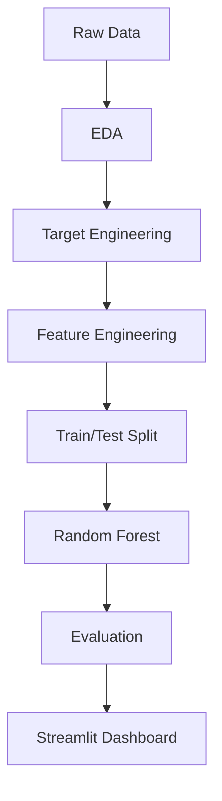

# ⚽ EPL Foul Win Probability Model

An end-to-end sports analytics application that predicts the probability a player will win a foul after receiving or recovering possession in EPL matches. The project includes raw data processing, engineered features, Random Forest modeling, evaluation artifacts, and a production-ready Streamlit dashboard.

---

## ✨ Project Highlights

- ✔ End-to-End ML Pipeline
- ✔ Sports Analytics for EPL event data
- ✔ Automated feature engineering
- ✔ Random Forest classification
- ✔ Probability prediction dashboard
- ✔ Model performance and explainability
- ✔ Production-ready code structure
- ✔ CI/CD and automated testing

---

## 🎯 Problem Statement

Predict whether a player will win a foul following a ball reception or recovery event in EPL matches.

| Input | Prediction Target | Business Value |
|---|---|---|
| Event type, pitch coordinates, match time, possession | Probability of foul-win outcome | Tactical insight for analysts, decision support for coaches, and scouting intelligence |

This is a binary classification problem where the model predicts whether the event leads to a foul-win outcome.

---

## 📦 Dataset

The project is built on StatsBomb Open Data and focuses on English Premier League event data.

| Metric | Value |
|---|---|
| Matches | 380 |
| Events | 1.31M+ |
| Candidate events | 381k |
| Positive class | Player wins a foul |
| Negative class | Player does not win a foul |
| Positive rate | Minority class, imbalanced prediction problem |

---

## 🧱 Project Architecture



---

## 📁 Repository Structure

```text
epl-foul-prediction/
├── .github/workflows/main.yml
├── data/processed/engineered_dataset.csv
├── models/random_forest_model.pkl
├── notebooks/
│   ├── 01_data_understanding.ipynb
│   ├── 02_target_creation.ipynb
│   ├── 03_feature_engineering.ipynb
│   ├── 04_model_training.ipynb
│   └── 05_model_evaluation.ipynb
├── outputs/
│   ├── metrics.csv
│   ├── feature_importance.csv
│   └── plots/
│       ├── confusion_matrix.png
│       ├── roc_curve.png
│       ├── precision_recall_curve.png
│       └── feature_importance_top20.png
├── src/
│   ├── config.py
│   ├── data_loader.py
│   ├── evaluate_model.py
│   ├── feature_engineering.py
│   ├── logger.py
│   ├── target_creation.py
│   ├── train_model.py
│   ├── utils.py
│   └── platform/app.py
├── tests/
│   ├── test_data_loader.py
│   ├── test_feature_engineering.py
│   └── test_target_creation.py
├── requirements.txt
└── README.md
```

---

## 🔧 Feature Engineering

The pipeline transforms raw event data into model-ready features.

| Feature | Role |
|---|---|
| X Coordinate | Captures depth on the pitch |
| Y Coordinate | Encodes lateral positioning |
| Distance to Goal | Measures scoring/foul pressure |
| Goal Angle | Quantifies attacking angle |
| Pitch Zone | Segments defensive, midfield, attacking phases |
| Event Type Encoding | Distinguishes receptions from recoveries |
| Match Time | Provides temporal context |

Each feature is generated automatically during inference, so users never need to engineer inputs manually.

---

## 🤖 Model Training

The trained model is a Random Forest classifier built on engineered event features.

- Model: `RandomForestClassifier`
- Training method: Train/Test split
- Features: spatial, temporal, event type, possession context
- Output: predicted probability of foul-win outcome
- Inference: probability scoring with threshold-driven interpretation

---

## 📈 Model Evaluation

The evaluation stage validates the model using classification and ranking metrics.

| Metric | Purpose |
|---|---|
| Accuracy | Measures overall correctness |
| Precision | Measures exactness of positive predictions |
| Recall | Measures coverage of positive cases |
| F1 Score | Balances precision and recall |
| ROC-AUC | Evaluates ranking quality across thresholds |
| PR-AUC | Focuses on performance with imbalanced classes |

Additional evaluation artifacts:

- Confusion Matrix
- ROC Curve
- Precision-Recall Curve
- Feature Importance

---

## 🚀 Streamlit Application

The interactive dashboard allows users to:

- Select event type
- Choose match time
- Pick pitch coordinates
- Enter possession number
- Automatically generate features
- Predict foul-win probability
- View confidence and classification outcome
- Explore feature importance
- Inspect model performance charts
- Review ROC and Precision-Recall curves
- Examine confusion matrix

No manual feature engineering is required.

---

## 📷 Screenshots

| Home | Prediction |
|---|---|
|  |  |
| Model Performance | Feature Importance |
|  |  |
| Confusion Matrix |
|  |

---

## ⚙️ Installation

```bash
git clone https://github.com/nagasantoshchavvakula/epl-foul-win-probability-model.git
cd epl-foul-win-probability-model
python -m venv venv
```

### Activate the environment

Windows:

```bash
venv\Scripts\activate
```

macOS / Linux:

```bash
source venv/bin/activate
```

Install dependencies:

```bash
pip install -r requirements.txt
```

---

## ▶️ Running the Project

### Run notebooks

Execute the notebooks in order to reproduce the data pipeline and model artifacts.

### Run Streamlit locally

```bash
streamlit run src/platform/app.py
```

### Deploy to Streamlit Community Cloud

1. Push this repository to GitHub.
2. Sign in to https://streamlit.io/cloud and create a new app.
3. Select this GitHub repository.
4. Set the main file path to:

```text
src/platform/app.py
```

5. Confirm the Python version and dependencies are installed from `requirements.txt`.

6. Deploy the app and visit the generated Streamlit Community Cloud URL.

---

## 🧪 Testing

Run unit tests:

```bash
pytest
```

Run verbose tests:

```bash
pytest -v
```

Run coverage:

```bash
pytest --cov=src
```

The repository also uses GitHub Actions to validate the pipeline on push and pull request events.

---

## 🧰 Technology Stack

| Category | Tools |
|---|---|
| Programming | Python |
| Data | Pandas, NumPy |
| Machine Learning | scikit-learn, XGBoost |
| Visualization | Matplotlib, Seaborn |
| Deployment | Streamlit |
| Testing | PyTest, pytest-cov |
| CI/CD | GitHub Actions |

---

## 💡 Skills Demonstrated

| Skill | Practice |
|---|---|
| Machine Learning | Predictive modeling, classification |
| Sports Analytics | EPL event-level modeling |
| Feature Engineering | Spatial and temporal feature creation |
| EDA | Data understanding and validation |
| Predictive Analytics | Probability scoring and thresholds |
| Random Forest | Ensemble modeling |
| Software Engineering | Reproducible pipeline structure |
| Testing | Unit tests and coverage |
| Streamlit | Interactive application development |
| GitHub Actions | CI automation |
| MLOps | Model evaluation and deployment |

---

## 🚀 Future Improvements

- SHAP model explainability
- MLflow experiment tracking
- Docker deployment
- REST API scoring service
- Cloud hosting on AWS/Azure/GCP
- Real-time match event analytics
- Cross-validation and hyperparameter optimization
- Probability calibration and threshold tuning

